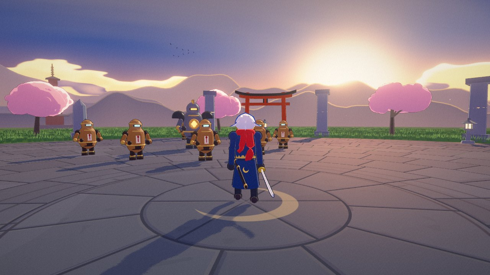
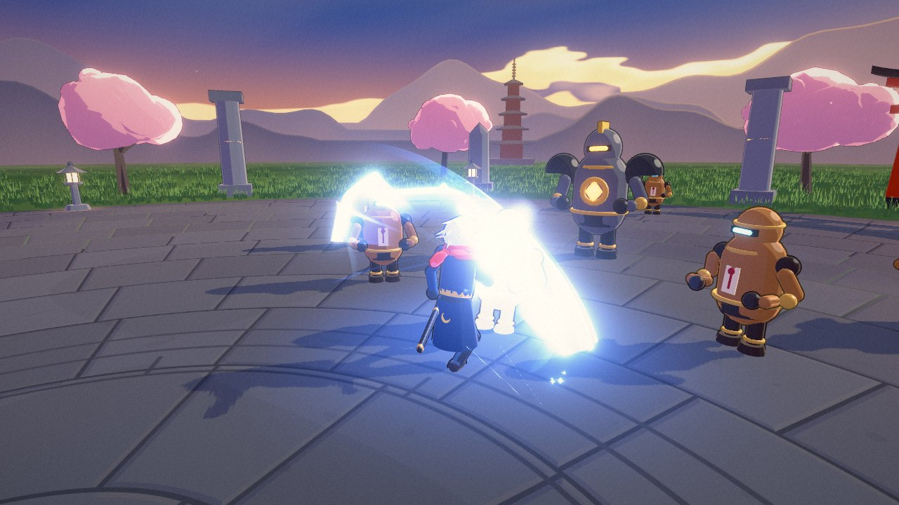
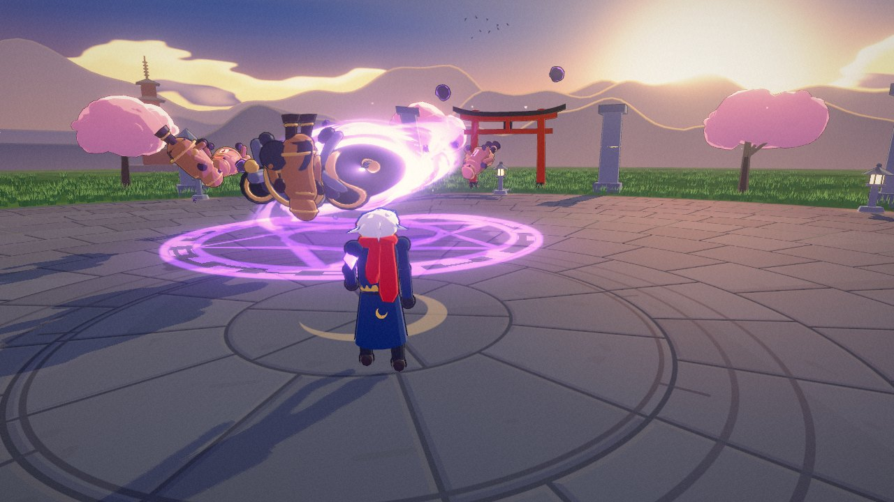
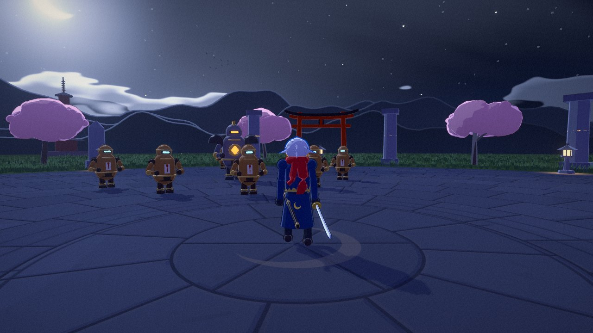
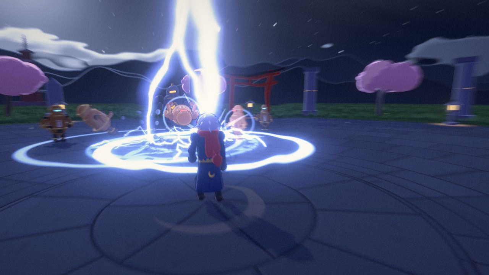

# VFX 수련장 — 카툰 전투 이펙트 체험

웹에서 돌아가는 3D 카툰렌더링 전투 이펙트 체험 프로그램 (three.js, 빌드 불필요).
점수도 승패도 없이, 열네 가지 무기 · 이동기 · 필살기로 훈련용 자동인형을 두드려 보는 이펙트 놀이터.



```bash
node tools/serve.mjs      # 또는: python3 -m http.server 8080
# → http://localhost:8080/          (달밤으로 시작: http://localhost:8080/?night)
```

| | |
|---|---|
|  |  |
|  |  |

- 실행 방법 · 조작법 · 무기/액션 목록 · 남은 문제: [REPORT.md](REPORT.md)
- 설계 결정 기록: [DECISIONS.md](DECISIONS.md)
- 스크린샷은 헤드리스 Chromium(소프트웨어 렌더러)에서 `tools/shoot.cjs`로 찍은 것.
